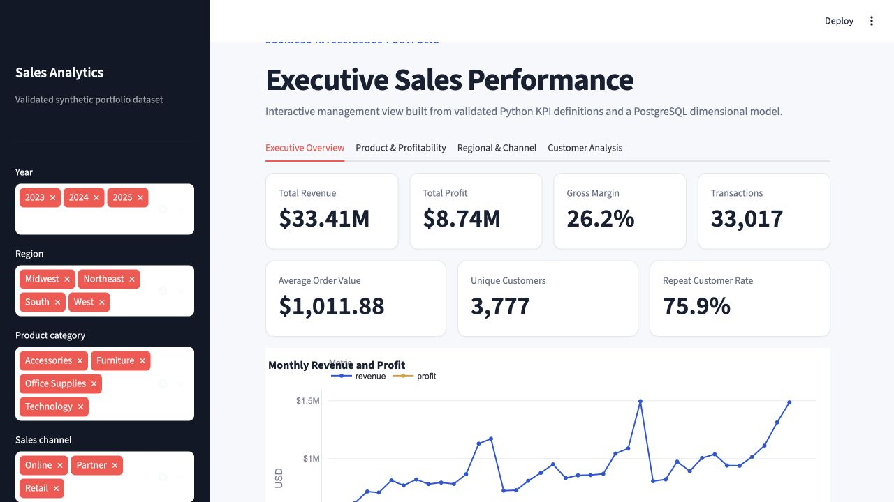
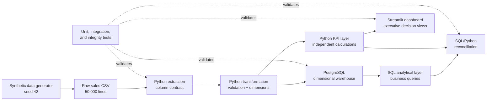
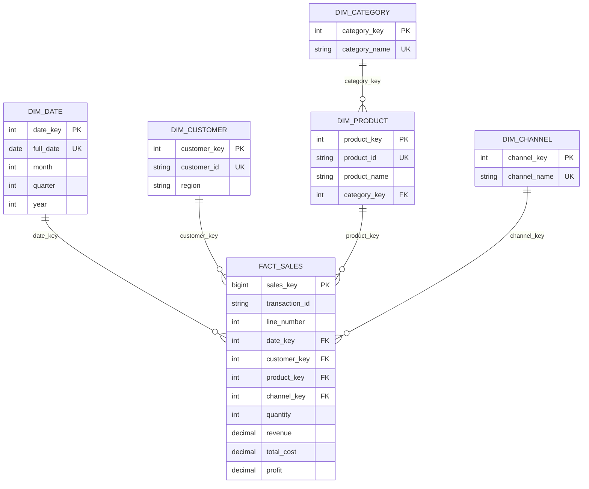

# Sales Analytics Platform

An end-to-end business intelligence platform that transforms **50,000 synthetic
sales lines** into a PostgreSQL dimensional warehouse, validated KPI layer, SQL
business analysis, and interactive executive dashboard. It covers data quality,
Python ETL, relational modeling, SQL analysis, KPI governance, visualization, and
clear business communication.

> **Data disclosure:** All sales and customer data is fictional and generated with
> a fixed seed. Findings demonstrate analytical methods and do not describe a real
> company.



## Key business findings

- **Revenue grew while margin compressed.** Annual revenue increased from
  **$9.95M in 2023 to $12.34M in 2025**, while gross margin declined from 26.59%
  to 25.88%.
- **Apex Pro Laptop combines scale with weak economics.** It produced **$7.78M in
  revenue** but only **$437K in profit**, a **5.62% gross margin** versus 26.17%
  overall.
- **Partner trades margin for order value.** It had the highest channel revenue
  at **$13.49M** and highest AOV at **$2,974.77**, but the weakest channel margin
  at **21.64%**.
- **Northeast grew fastest in the latest year.** Its 2025 revenue increased
  **19.48% YoY**, while West remained the largest region at $10.82M across the
  dataset period.
- **Office Supplies had the weakest latest category trajectory.** Its 2025
  revenue declined **7.46% YoY**; this is a descriptive signal, not evidence of a
  cause.

## Project highlights

- 50,000 sales lines, 33,017 transactions, and 3,777 active customers
- Deterministic Python data generator and tested ETL pipeline
- PostgreSQL star schema with five dimensions and a sales-line fact table
- Six version-controlled SQL analyses and 13 warehouse integrity checks
- Canonical KPI definitions independently reconciled between SQL and Python
- Four-view Streamlit and Plotly dashboard with practical business filters
- 46 passing unit/static/dashboard tests and 2 PostgreSQL integration tests

## Architecture



The warehouse owns durable relational storage and SQL analysis. Python owns
reproducible generation, validation, transformation, and an independent KPI path.
That separation makes silent counting or aggregation errors easier to detect.
See [the architecture documentation](docs/architecture.md) for design decisions.

## Technology stack

| Area | Technology | Purpose |
|---|---|---|
| Data engineering | Python, pandas, NumPy | Generate, validate, and transform sales data |
| Warehouse | PostgreSQL 16, psycopg | Store and query the dimensional model |
| Analysis | SQL, Python | Calculate and independently reconcile business KPIs |
| Dashboard | Streamlit, Plotly | Present interactive management views |
| Quality | pytest, Ruff, SQL assertions | Test calculations, contracts, integrity, and code quality |

## Data model

`fact_sales` has one row per **transaction product line**. A transaction may have
multiple rows, so order metrics use `COUNT(DISTINCT transaction_id)` rather than
fact-row counts.



Region remains in `dim_customer` because each synthetic customer has one stable
region and the dataset has no separate geographic hierarchy or attributes.

## Dashboard views

The dashboard recalculates results through the canonical Python KPI layer when a
user filters by **year, region, product category, or sales channel**.

1. **Executive Overview** — revenue, profit, margin, transactions, AOV,
   customers, repeat rate, trends, regions, and channels.
2. **Product & Profitability** — product/category rankings, category trends, and
   a revenue-versus-margin view that exposes high-volume, weak-margin products.
3. **Regional & Channel** — regional growth and profitability plus channel
   revenue, profit, margin, and AOV tradeoffs.
4. **Customer Analysis** — repeat behavior, dataset-period customer value,
   revenue distribution, and top-10 customer concentration.

## Business questions answered

- Is revenue growth translating into profit growth and healthy margin?
- Which products and categories combine scale with strong economics?
- Which regions are largest, fastest growing, and most profitable?
- Which sales channels trade margin for higher order value?
- How much revenue comes from repeat and high-value customers?
- Is revenue concentrated among a small group of customers?

The six auditable queries are in [`sql/queries/`](sql/queries/).

## KPI framework

Canonical definitions specify formula, grain, denominator, time behavior, and
caveats for revenue, profit, gross margin, AOV, unique customers, repeat customer
rate, and segment performance. SQL results are compared with calculations from
[`analysis/kpis.py`](src/sales_analytics/analysis/kpis.py), rather than validating
SQL with another SQL query. Full definitions are in
[`docs/kpi_definitions.md`](docs/kpi_definitions.md).

## Validation and testing

The deterministic release dataset currently validates as follows:

| Check | Result |
|---|---:|
| Unit, static SQL, and dashboard tests | 46 passed |
| PostgreSQL integration tests | 2 passed |
| SQL warehouse integrity checks | 13 passed, 0 violations |
| Analytical SQL files | 6 executed successfully |
| Physical `fact_sales` rows | 50,000 |
| SQL/Python KPI reconciliation | Passed |
| Ruff lint and formatting | Passed |

Integrity checks cover orphan foreign keys, duplicate natural IDs, duplicate
sales-line grain, nulls, row counts, and financial reconciliation. Integration
tests are kept separate because they rebuild a disposable local warehouse.

## Repository structure

```text
.
├── dashboard/                    # Streamlit application
├── data/                         # Ignored generated data; tracked placeholders
├── docs/                         # Architecture, KPI definitions, and images
├── scripts/                      # Local PostgreSQL installation/lifecycle helpers
├── sql/
│   ├── ddl/                      # Repeatable dimensional schema
│   ├── queries/                  # Decision-focused analytical SQL
│   └── tests/                    # Warehouse integrity assertions
├── src/sales_analytics/
│   ├── analysis/                 # Canonical KPIs and calculated insights
│   ├── dashboard/                # Filter preparation without duplicate KPI logic
│   └── pipeline/                 # Generate, extract, transform, and load
├── tests/
│   ├── integration/              # Live PostgreSQL reconciliation
│   └── unit/                     # Data, transform, KPI, SQL, and dashboard tests
├── Makefile                      # Verified developer commands
└── pyproject.toml                # Dependencies and tool configuration
```

## Quick start

Prerequisites: Python 3.11+, Git, `make`, `curl`, and a C compiler. On macOS,
install Apple Command Line Tools first. Docker is not required for the verified
project-local workflow.

```bash
cp .env.example .env
make install
make postgres-install
make generate
make db-up
make load
make dashboard
```

Open the Streamlit URL printed in the terminal, normally
`http://localhost:8501`. Stop PostgreSQL when finished:

```bash
make db-down
```

## Detailed local setup

The project-local PostgreSQL installer downloads PostgreSQL 16.15 source,
verifies its published SHA-256 checksum, compiles it under ignored `.local/`, and
stores runtime data under ignored `.postgres/`. The Python application, local
PostgreSQL lifecycle script, and SQL check commands all read the same `.env`
configuration.

```bash
cp .env.example .env
make install
make postgres-install
make generate
make db-up
make db-init
make load
make test
make test-integration
make db-check
make sql-check
make lint
.venv/bin/ruff format --check .
make db-down
```

`make generate` reproduces exactly 50,000 lines from January 1, 2023 through
December 31, 2025 using seed 42. The generated `data/raw/sales.csv` is ignored
because it is reproducible. `make load` validates the source, rebuilds the schema,
and loads dimensions before facts in one transaction.

Docker users may instead start the included [`compose.yaml`](compose.yaml), but
the Makefile database lifecycle commands target the verified project-local
PostgreSQL installation.

## SQL analysis

The version-controlled SQL layer is organized by business decision area:

```text
01_executive_summary.sql
02_revenue_trends.sql
03_product_performance.sql
04_region_performance.sql
05_channel_performance.sql
06_customer_analysis.sql
```

Run all analyses with immediate failure on a SQL error using `make sql-check`.
Run the audit queries separately with `make db-check`.

## Limitations

- The dataset is synthetic and contains designed patterns for analytical testing.
- Sales represent completed orders; returns, cancellations, taxes, and shipping
  are out of scope.
- Customer value is limited to the 2023–2025 dataset period, not true lifetime
  value.
- Findings are descriptive. The data cannot establish why a metric changed.
- The dashboard runs locally and is not deployed from this repository.
- The project uses one currency (USD) and date-level, not timestamp-level, data.

## Future improvements

Appropriate extensions would include automated CI checks, richer geographic
attributes, return/refund modeling, and documented performance tests at larger
scale. Forecasting and machine learning would only be useful if tied to a clearly
defined planning question and evaluation method.

## License

This project is available under the [MIT License](LICENSE).
