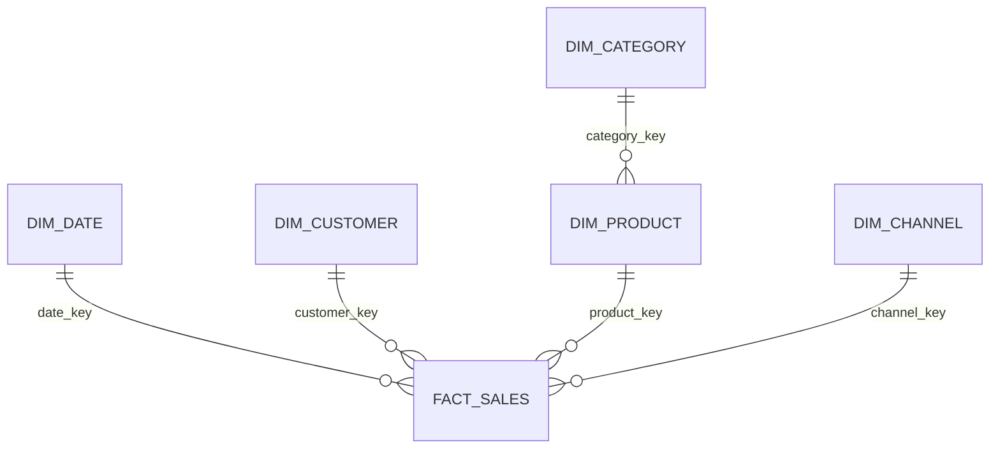

# Project Architecture

## 1. Architecture goals

The platform turns source-like sales data into validated management metrics while
keeping each stage explicit, testable, and reproducible. The design favors plain
Python, explicit SQL, PostgreSQL, and a dimensional model over unnecessary
orchestration or cloud infrastructure.

The manager-facing questions are:

1. Is revenue growing, and where is growth coming from?
2. Are sales profitable after discounts and product costs?
3. Which regions, categories, products, and channels deserve attention?
4. Are customers returning, or is performance dependent on one-time buyers?

## 2. Repository structure

```text
data/
  raw/                 Generated source-like CSV files; never edited in place
  processed/           Reserved for optional cleaned exports and inspection
docs/
  architecture.md      Current design, schema, assumptions, and data flow
  kpi_definitions.md   Canonical metric formulas, grains, and caveats
sql/
  ddl/                 Ordered warehouse schema definitions
  queries/             Decision-focused analytical SQL
  tests/               SQL assertions for keys, reconciliation, and valid ranges
src/sales_analytics/
  config.py            Environment settings and database connection values
  pipeline/
    generate.py        Reproducible synthetic source-data generation
    extract.py         Read source files and enforce expected columns/types
    transform.py       Clean values, derive measures, and prepare dimensions/facts
    load.py            Transactional PostgreSQL loading
  analysis/
    kpis.py            Reusable Python KPI calculations for validation
    insights.py        Evidence-based management signals
tests/
  unit/                Fast transformation, KPI, SQL, and dashboard tests
  integration/         PostgreSQL schema/load/reconciliation tests
```

Generated data, secrets, virtual environments, caches, and local database files
are excluded from Git. Small `.gitkeep` files preserve the intentional raw and
processed data folders without committing generated CSV files.

## 3. Database schema

### Grain

`fact_sales` contains one row per product line within a transaction. A transaction
may contain multiple products, so order-level metrics must count distinct
`transaction_id` values rather than fact rows.

### Tables

| Table | Purpose | Important columns |
|---|---|---|
| `dim_date` | Calendar attributes for time analysis | `date_key` (PK), `full_date`, `day`, `month`, `month_name`, `quarter`, `year`, `day_of_week`, `is_weekend` |
| `dim_customer` | Customer attributes | `customer_key` (PK), `customer_id` (business key, unique), `region` |
| `dim_category` | Product grouping | `category_key` (PK), `category_name` (unique) |
| `dim_product` | Product master data | `product_key` (PK), `product_id` (business key, unique), `product_name`, `category_key` (FK) |
| `dim_channel` | Sales-channel lookup | `channel_key` (PK), `channel_name` (unique) |
| `fact_sales` | Additive sales-line measures | `sales_key` (PK), `transaction_id`, `line_number`, dimension FKs, `unit_price`, `quantity`, `discount`, `revenue`, `unit_cost`, `total_cost`, `profit` |

Implemented constraints include a unique key on `(transaction_id, line_number)`,
positive quantities and prices, a discount range of 0 through 1, non-negative
revenue and total cost, and financial reconciliation checks for revenue, cost, and
profit. Financial columns use PostgreSQL `NUMERIC`, not floating point. Indexes on
the date, customer, product, and channel foreign keys support common analytical
joins and filters.

### Relationships



This is a star schema with one small snowflaked product hierarchy. Category stays
separate because it is a reusable product grouping. Region is stored directly on
`dim_customer`: it contains only a name and no independent geographic attributes
or hierarchy, so a separate `dim_region` would add a join without analytical
value. If future data adds countries, territories, managers, or regional targets,
region can become its own dimension.

## 4. Main Python modules

| Module | Responsibility |
|---|---|
| `config.py` | Read environment variables once and expose database and project paths. |
| `pipeline/generate.py` | Create deterministic customers, products, transactions, seasonal patterns, discounts, channels, and controlled business patterns. |
| `pipeline/extract.py` | Load raw CSV data and reject absent files or missing columns. |
| `pipeline/transform.py` | Validate stable relationships, normalize types, assign deterministic keys, and split rows into dimension/fact frames. |
| `pipeline/load.py` | Rebuild and load dimensions before facts in one transaction, using PostgreSQL `COPY` for the fact batch. |
| `analysis/kpis.py` | Independently calculate core KPIs in Python to cross-check SQL results. |
| `analysis/insights.py` | Convert validated results into concise evidence-based observations. |
| `dashboard/data.py` | Apply conformed-dimension filters without duplicating KPI formulas. |
| `dashboard/app.py` | Render the four-view Streamlit and Plotly management dashboard. |

Thin command-line entry points support generation and loading. A workflow
orchestrator, web API, and object-relational mapper are not required for the
current scope.

## 5. Data pipeline flow

1. **Generate:** create a seeded CSV at the required line-item grain.
2. **Extract:** read the immutable raw file and verify its data contract.
3. **Validate:** detect null keys, duplicates, invalid dates, impossible prices,
   discount violations, and arithmetic inconsistencies.
4. **Transform:** standardize types, validate financial reconciliation, assign
   deterministic surrogate keys, and build distinct dimension and fact records.
5. **Load:** recreate the development schema, insert dimensions, and stream facts
   with `COPY` in one transaction.
6. **Reconcile:** compare source and database row counts and financial totals.
7. **Analyze:** run version-controlled business queries and canonical KPI
   calculations.
8. **Present:** apply dimension filters and render results from the reconciled KPI
   layer in Streamlit.

Raw input remains unchanged. Failed validation or reconciliation stops the load
instead of silently dropping or correcting questionable rows.

## 6. KPI definitions

Unless a query states otherwise, KPIs use completed sales, order date, and the
selected analysis period.

| KPI | Canonical definition | Decision supported |
|---|---|---|
| Total revenue | `SUM(revenue)` | Overall sales scale |
| YoY revenue growth | `(current_year_revenue - prior_year_revenue) / prior_year_revenue`; null when prior revenue is zero or missing | Whether annual sales momentum is improving |
| Gross profit | `SUM(profit)`, reconciled to `SUM(revenue) - SUM(total_cost)` | Dollars retained after product cost |
| Gross margin | `SUM(profit) / SUM(revenue)`; null when revenue is zero | Profitability independent of sales scale |
| Average order value | `SUM(revenue) / COUNT(DISTINCT transaction_id)` | Typical transaction value |
| Customer count | `COUNT(DISTINCT customer_key)` | Active customer base in the selected period |
| Repeat customer rate | Customers with at least 2 distinct transactions / customers with at least 1 transaction within the selected analysis period | Customer return behavior |
| Dimension performance | Revenue, profit, margin, orders, units, and customers grouped by region, product/category, or channel | Segment comparison |
| Monthly trend | Revenue and profit grouped by calendar month | Seasonality and trend monitoring |
| Top/bottom products | Products ranked by revenue or profit, with margin shown as a guardrail | Product portfolio decisions without rewarding unprofitable volume |

Full canonical definitions and caveats are maintained in
[`kpi_definitions.md`](kpi_definitions.md).

## 7. Implemented SQL business questions

The analytical SQL answers:

1. How are revenue, profit, margin, transactions, customers, and AOV performing?
2. How do annual and monthly revenue and profit change over time?
3. Which categories are growing or declining?
4. Which products rank highest and lowest by revenue, profit, and margin?
5. Which regions are growing fastest while maintaining profitability?
6. Which channels combine revenue, margin, and order value most effectively?
7. Which customers generate the most dataset-period revenue?
8. What share of revenue comes from the top 10 customers?

The queries use the same documented metric definitions that are independently
implemented in Python for reconciliation.

## 8. Dependencies

### Runtime

1. Python 3.11+
2. `pandas` for tabular cleaning and transformations
3. `numpy` for deterministic generation and numerical operations
4. `psycopg` for PostgreSQL access and `COPY`
5. `python-dotenv` for local environment loading
6. `plotly` for interactive business charts
7. `streamlit` for the dashboard application

### Development

1. `pytest` for unit and integration tests
2. `ruff` for formatting and linting

The application, SQL-check commands, and project-local PostgreSQL lifecycle script
read the same `.env` settings. PostgreSQL 16 runs from a project-local source
installation on the verified macOS workflow. Docker Compose remains available as
an alternative database runtime.

## 9. Assumptions and boundaries

1. The synthetic source represents completed sales only; cancellations, returns,
   taxes, and shipping are out of scope.
2. `discount` is a rate from `0.00` to `1.00`, not a currency amount.
3. `revenue = unit_price * quantity * (1 - discount)`.
4. `total_cost` is extended line cost; `profit = revenue - total_cost`.
5. Customers have one assigned region in this dataset.
6. Products have stable names and categories, while transactional price and cost
   are stored in the fact table to preserve historical values.
7. The generated release dataset spans January 2023 through December 2025.
8. Currency is USD and timestamps are represented as dates; no foreign-exchange or
   time-zone logic is included.
9. PostgreSQL is the relational source of truth after successful reconciliation.
10. Streamlit is the local dashboard runtime; remote deployment is out of scope.

## Why this architecture

The star schema matches how analytical workloads slice measures across time,
customers, products, and channels. Python owns source handling and testable
transformation logic; PostgreSQL owns durable relational storage and set-based
analytics. SQL remains explicit and reviewable, and the independent Python KPI
path provides a second implementation for detecting aggregation errors. The
project-local PostgreSQL workflow keeps the database repeatable while Streamlit
keeps the presentation layer inspectable and portable.
